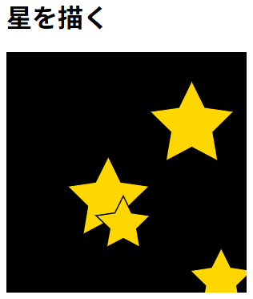

# draw_stars

## 概要

JavaScriptで星を描きます。



## コード

```js
/**
 * Canvasに指定したパラメータで星を描画します。
 * * @param {CanvasRenderingContext2D} ctx - 描画コンテキスト
 * @param {number} x - 星の中心のX座標
 * @param {number} y - 星の中心のY座標
 * @param {number} outerRadius - 星の角までの半径（外径）
 * @param {number} [innerRadius=outerRadius/2] - 角と角の間のくぼみまでの半径（内径）
 * @param {number} [spikes=5] - 星の角の数
 * @param {number} [rotation=Math.PI*1.5] - 回転角度
 */
const drawStar = (ctx, x, y, outerRadius, innerRadius = outerRadius / 2, spikes = 5, rotation = Math.PI * 1.5) => {
    const step = Math.PI / spikes;    // 頂点とくぼみの角度の間隔 (1/2角)
    let first = true; // 最初の描画か？
    for (let i = 0; i < spikes; i++) {
        // 1. 頂点の計算 (外径)
        let x0 = x + outerRadius * Math.cos(rotation);
        let y0 = y + outerRadius * Math.sin(rotation);
        if (first) {
            first = false;
            ctx.moveTo(x0, y0);
        } else {
            ctx.lineTo(x0, y0);
        }
        rotation += step; // 次のくぼみへ向けて回転
        // 2. くぼみの計算 (内径)
        let x1 = x + innerRadius * Math.cos(rotation);
        let y1 = y + innerRadius * Math.sin(rotation);
        ctx.lineTo(x1, y1);
        rotation += step; // 次の頂点へ向けて回転
    }
};

// 使い方
let ctx = canvas.getContext('2d');
ctx.beginPath(); // パスの開始
drawStar(ctx, 100, 100, 50); // 星を描く
ctx.strokeStyle = "black"; // 線の色
ctx.lineWidth = 3; // 線の太さ
ctx.fillStyle = "gold"; // 星の色
ctx.stroke(); // 線を描く
ctx.fill(); // 塗りつぶす
```
